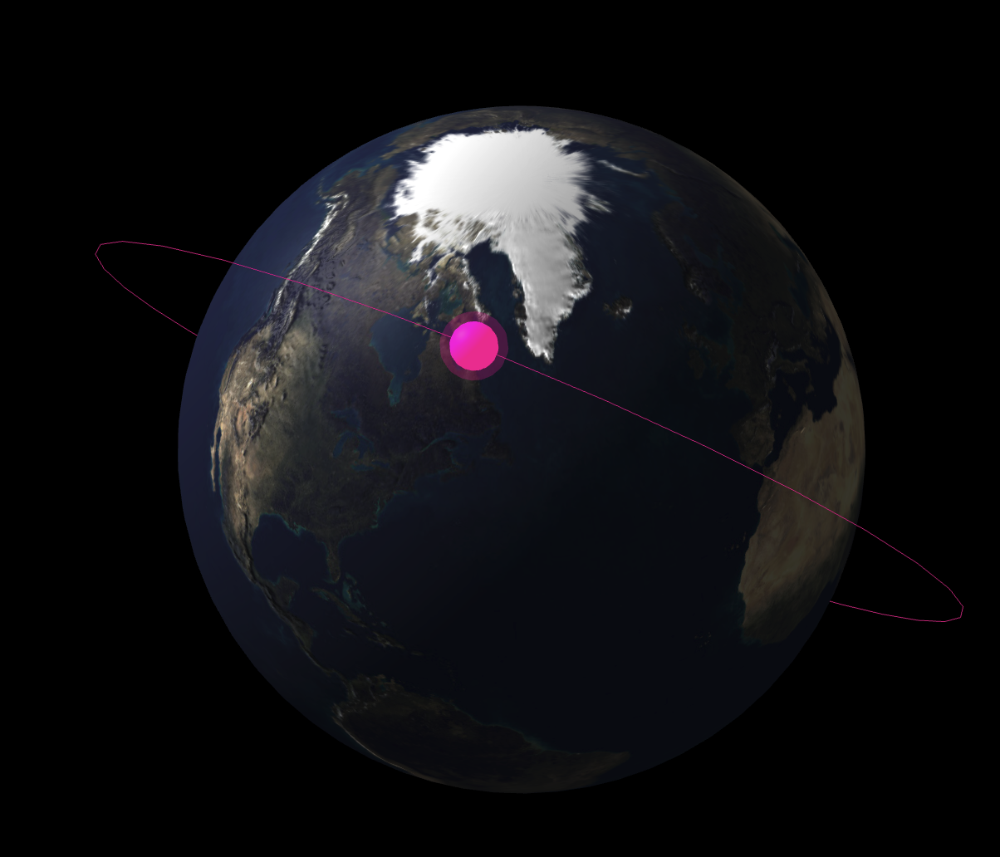

# TLEGO (Two Line Elements)

A Go CLI tool for interacting with Two Line Elements (TLE) data and satellite tracking, with powerful visualization capabilities.



## Overview

This CLI tool provides functionalities to:
- Fetch and manage TLE (Two Line Elements) data
- Track satellite positions in real-time
- Generate satellite position reports
- Create 3D visualizations of satellite orbits
- Generate map links for satellite ground tracks
- Access Celestrak's satellite catalog
- Compare and analyze multiple satellite orbits

## Installation

```bash
go get github.com/Mohammed-Ashour/tlego
```

## CLI Usage

The `tlego` CLI tool provides several commands to interact with TLE data and visualize satellite orbits.
### Installation
```bash
go install github.com/Mohammed-Ashour/tlego
```
## General Command Structure

```bash
tlego <command> [arguments] [flags]
```

### Commands

#### 1. Fetch TLE Data for a Satellite

```bash
tlego tle <NORAD-ID>
```

- **Description:** Fetches the Two-Line Element (TLE) data for a satellite identified by its NORAD ID.
- **Example:**
  ```bash
  tlego tle 25544
  ```

#### 2. Visualize Satellite Orbit

```bash
tlego viz <NORAD-ID>
```

- **Description:** Creates a 3D visualization of the satellite's orbit.
- **Example:**
  ```bash
  tlego viz 25544
  ```

#### 3. List Satellite Groups

```bash
tlego list --sat-group <satellite-group>
```

- **Description:** Lists all satellites in a specific satellite group.
- **Example:**
  ```bash
  tlego list --sat-group "Starlink"
  ```

#### 4. Predict Satellite Position

```bash
tlego predict <NORAD-ID> --time <timestamp>
```

- **Description:** Predicts where a satellite will be at a specific time.
- **Flags:**
  - `--time`: Specify the time in ISO 8601 format (e.g., `2024-02-26T12:00:00Z`).
- **Example:**
  ```bash
  tlego predict 25544 --time 2024-02-26T12:00:00Z
  ```

#### 5. Track Real-Time Satellite Position

```bash
tlego track <NORAD-ID>
```

- **Description:** Continuously tracks the real-time position of a satellite.
- **Example:**
  ```bash
  tlego track 25544
  ```

#### 6. Search for Satellites by Name

```bash
tlego search <keyword>
```

- **Description:** Searches for satellites by name or partial name match.
- **Example:**
  ```bash
  tlego search starlink
  ```

#### 7. Generate Satellite Report

```bash
tlego report <NORAD-ID>
```

- **Description:** Generates a detailed report for a satellite, including:
  - TLE data
  - Orbital parameters (e.g., inclination, eccentricity, mean motion)
  - Current position (latitude, longitude, altitude)
  - Google Maps URL for visualization
- **Example:**
  ```bash
  tlego report 25544
  ```

- **Sample Output:**

  ```plaintext
  Satellite Report
  ================
  Name: ISS (ZARYA)
  NORAD ID: 25544

  TLE Data:
  ---------
  ISS (ZARYA)
  1 25544U 98067A   24057.91666667  .00000000  00000+0  00000+0 0    04
  2 25544  51.6416 247.4627 0006946 130.5360 325.0288 15.49140836    00

  Orbital Parameters:
  --------------------
  Inclination: 51.641600° (degrees)
  Eccentricity: 0.000695
  Mean Motion: 15.491408 (revolutions per day)
  Altitude: 408.23 km

  Current Position (as of 2024-02-26T12:00:00Z):
  ----------------------------
  Latitude: 37.800000°
  Longitude: -122.400000°
  Altitude: 408.23 km

  Google Maps URL:
  ----------------
  https://www.google.com/maps/?q=37.800000,-122.400000
  ```
---

## Library Usage

The tlego CLI is built on top of go-satellite-v2 for all orbital calculations. Here's how to use the CLI programmatically:

```go
package main

import (
    "fmt"
    "time"
    "github.com/Mohammed-Ashour/go-satellite-v2/pkg/satellite"
    "github.com/Mohammed-Ashour/tlego/pkg/celestrak"
)

func main() {
    // Fetch TLE from Celestrak
    tle, _ := celestrak.GetSatelliteTLEByNoradID("25544")

    // Create satellite using go-satellite-v2
    sat := satellite.NewSatelliteFromTLE(tle, satellite.GravityWGS84)

    // Get current position
    lat, lon, alt, _ := sat.Locate(time.Now())
    
    fmt.Printf("Position: %.6f°, %.6f°, %.6f km\n", lat, lon, alt)
}
```

---

## Features

- Seamless integration with go-satellite-v2 for high-precision orbit propagation
- Robust CLI interface for satellite tracking and visualization
- Real-time position tracking and orbit prediction
- Support for multiple mapping services (Google Maps, OpenStreetMap)
- Interactive 3D orbit visualization
- Comprehensive satellite group management
- Efficient TLE data fetching and caching

---

## Dependencies
- Go 1.22 or later
- github.com/Mohammed-Ashour/go-satellite-v2 (SGP4 propagation engine)
- gopkg.in/yaml.v3 (Configuration handling)

---

## Contributing
- Fork the repository
- Create your feature branch (`git checkout -b feature/amazing-feature`)
- Commit your changes (`git commit -m 'Add amazing feature'`)
- Push to the branch (`git push origin feature/amazing-feature`)
- Open a Pull Request

---

## References & Credits

This project uses [go-satellite-v2](https://github.com/Mohammed-Ashour/go-satellite-v2) for SGP4 orbit propagation. 
The visualization and CLI components are original work built to provide an accessible interface for satellite tracking 
and analysis.

---

## License

[](https://opensource.org/licenses/MIT)

MIT License

Copyright (c) 2024 Mohammed Ashour

Permission is hereby granted, free of charge, to any person obtaining a copy
of this software and associated documentation files (the "Software"), to deal
in the Software without restriction, including without limitation the rights to use, copy, modify, merge, publish, distribute, sublicense, and/or sell copies of the Software, and to permit persons to whom the Software is furnished to do so, subject to the following conditions:

The above copyright notice and this permission notice shall be included in all
copies or substantial portions of the Software.

THE SOFTWARE IS PROVIDED "AS IS", WITHOUT WARRANTY OF ANY KIND, EXPRESS OR
IMPLIED, INCLUDING BUT NOT LIMITED TO THE WARRANTIES OF MERCHANTABILITY,
FITNESS FOR A PARTICULAR PURPOSE AND NONINFRINGEMENT. IN NO EVENT SHALL THE
AUTHORS OR COPYRIGHT HOLDERS BE LIABLE FOR ANY CLAIM, DAMAGES OR OTHER
LIABILITY, WHETHER IN AN ACTION OF CONTRACT, TORT OR OTHERWISE, ARISING FROM,
OUT OF OR IN CONNECTION WITH THE SOFTWARE OR THE USE OR OTHER DEALINGS IN THE
SOFTWARE.
